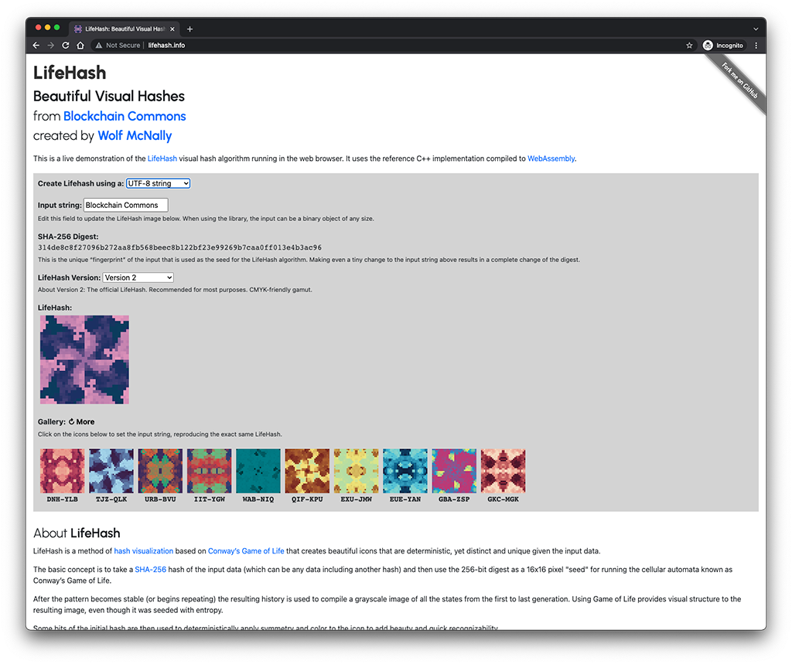

# LifeHash: Beautiful Visual Hashes

* &nbsp;&nbsp; ***part of the [crypto commons](https://github.com/BlockchainCommons/crypto-commons/blob/master/README.md) technology family***

### _by [Wolf McNally](https://www.github.com/wolfmcnally) and [Christopher Allen](https://www.github.com/ChristopherA)_

<a href="https://lifehash.info"></a>
This is a central repo for LifeHash, a method of hash visualization that creates beautiful, deterministic icons.
<br><br>

It also contains the code for our [lifehash.info](https://lifehash.info) demonstration site for LifeHash, which uses our [reference C++ implementation of LifeHash](https://github.com/BlockchainCommons/bc-lifehash) compiled to [WebAssembly](https://webassembly.org/). The page itself can be accessed [here](http://lifehash.info).

## Overview

LifeHash is a method of hash visualization based on Conway's Game of Life that creates beautiful icons that are deterministic, yet distinct and unique given the input data.

The basic concept is to take a SHA-256 hash of the input data (which can be any data including another hash) and then use the 256-bit digest as a 16x16 pixel "seed" for running the cellular automata known as [Conway’s Game of Life](https://en.wikipedia.org/wiki/Conway's_Game_of_Life).

After the pattern becomes stable (or begins repeating) the resulting history is used to compile a grayscale image of all the states from the first to last generation. Using Game of Life provides visual structure to the resulting image, even though it was seeded with entropy.

Some bits of the initial hash are then used to deterministically apply symmetry and color to the icon to add beauty and quick recognizability.

View the LifeHash explainer video for more details:

[](https://www.youtube.com/watch?v=cu0K__KLxKo)

See a LifeHash demo at [LifeHash.info](https://lifehash.info/).

Also see our [LifeHash Developer page](https://developer.blockchaincommons.com/lifehash/) and the info on the [Object Identity Block (OIB)](https://developer.blockchaincommons.com/oib/).

## Additional Information

The following files contain more information about LifeHash:

* [Use Cases](Nexus-Docs/Use-Cases.md) — Why use LifeHash?
* [Tips](Nexus-Docs/Tips.md) — Advice for presenting and using LifeHashes.
* [LifeHashes in Five Flavors](Nexus-Docs/Versions.md) — Five different ways to present LifeHashes.

## Implementations

Reference libraries are available in a variety of libraries. The C/C++ implementation considered the "canonical" implementation and should be suitable for binding to other languages such as Java and Python and cross-compilation into WebAssembly. In order to work from a single main codebase, we expect that implementation to eventually replace the pure Swift implementation.

| Type | Name | Language | Note |
|------|------|----------|------|
| Reference | [bc-lifehash](https://github.com/BlockchainCommons/bc-lifehash) | C++/C
| Third-Party | [bc-lifehash-python](https://github.com/BlockchainCommons/bc-lifehash-python) | Python | [Cramium](https://cramiumsolutions.com/)
| Reference | [LifeHash](https://github.com/BlockchainCommons/LifeHash) | Swift
| Reference | [LifeHash](https://github.com/BlockchainCommons/LifeHash) | Mathematica/Wolfram Language | `version1` only

## Command-Line Tools

Command-line reference tools demonstrate our  libraries by generating LifeHash images as PNG files.

| Name | Language |
|-----|-----|
| [lifehash-cli](https://github.com/BlockchainCommons/bc-lifehash-cli) | C++ |
| [LifeHashTool](https://github.com/BlockchainCommons/LifeHashTool) | Swift |

## Gordian Principles

**LifeHash** is a specification meant to display the [Gordian Principles](https://github.com/BlockchainCommons/Gordian#gordian-principles), which are philosophical and technical underpinnings to Blockchain Commons' Gordian technology. This includes:

* **Independence.** LifeHash allows you to personally verify data, rather than depending entirely on applications.
* **Privacy.** LifeHash improves your privacy by allowing identification through [functional identity](https://github.com/WebOfTrustInfo/rwot9-prague/blob/master/topics-and-advance-readings/functional-identity-primer.md).
* **Resilience.** LifeHash helps to protect from scams built on unverified fake data.
* **Openness.** LifeHash is an open specification.

## LifeHash.info Demo Installation Instructions

To install your own copy of the [LifeHash.info website](https://lifehash.info):

* **Prerequsites:** Node, Emscripten

```
git clone https://github.com/BlockchainCommons/lifehash.info/
cd lifehash.info
git submodule update --init
npm install
./build_wasm.sh
npm run dev
```

## LifeHash.Info Demo Usage Instructions

The [LifeHash.info website](https://lifehash.info) allows you to view LifeHashes for UTF-8 strings and SHA-256 hashes, which you can enter on the page itself, or request through a URL.

### Requesting a Specific LifeHash

You can use a `s=` query parameter in the URL to populate the string input field with a specific value. For example:

[http://lifehash.info?s=RBH-AOZ](http://lifehash.info?s=RBH-AOZ)

If you want to generate a LifeHash directly from a SHA-256 digest, you can use a `d=` query parameter in the URL:

[http://lifehash.info?d=70b0db749f1cb026282693b236048cefa3395fc580e91b7c62666b0bdc97c0e3](http://lifehash.info?d=70b0db749f1cb026282693b236048cefa3395fc580e91b7c62666b0bdc97c0e3)

## Samples from the "LifeHash Example" demo app:

"LifeHash Example" (part of the Swift implementation) lets you scroll through an endless table of LifeHashes generated from sequential integers, and tap on any of them to get a closer look. The selector at the top lets you choose to browse `.version2`, `.detailed`, `.fiducial`, and `.grayscaleFiducial` LifeHashes.

 

## Samples From the "LifeHash Gallery" demo app:

"LifeHash Gallery" shows an elegant, artistic presentation of various collections of LifeHashes that automatically change every ten seconds. The latest version shows `.version2`, `.detailed`, and `.fiducial` LifeHashes.


## Origin, Authors, Copyright & Licenses

Unless otherwise noted (either in this [/README.md](./README.md) or in the file's header comments) the contents of this repository are Copyright © 2020-2022 by Blockchain Commons, LLC, and are [licensed](./LICENSE.md) under the [spdx:BSD-2-Clause Plus Patent License](https://spdx.org/licenses/BSD-2-Clause-Patent.html).

In most cases, the authors, copyright, and license for each file reside in header comments in the source code. When it does not, we have attempted to attribute it accurately in the table below.

## Financial Support

**LifeHash** is a project of [Blockchain Commons](https://www.blockchaincommons.com/). We are proudly a "not-for-profit" social benefit corporation committed to open source & open development. Our work is funded entirely by donations and collaborative partnerships with people like you. Every contribution will be spent on building open tools, technologies, and techniques that sustain and advance blockchain and internet security infrastructure and promote an open web.

To financially support further development of **LifeHash** and other projects, please consider becoming a Patron of Blockchain Commons through ongoing monthly patronage as a [GitHub Sponsor](https://github.com/sponsors/BlockchainCommons). You can also support Blockchain Commons with bitcoins at our [BTCPay Server](https://btcpay.blockchaincommons.com/).

## Contributing

We encourage public contributions through issues and pull requests! Please review [CONTRIBUTING.md](./CONTRIBUTING.md) for details on our development process. All contributions to this repository require a GPG signed [Contributor License Agreement](./CLA.md).

### Discussions

The best place to talk about Blockchain Commons and its projects is in our GitHub Discussions areas.

[**Gordian Developer Community**](https://github.com/BlockchainCommons/Gordian-Developer-Community/discussions). For standards and open-source developers who want to talk about interoperable wallet specifications, please use the Discussions area of the [Gordian Developer Community repo](https://github.com/BlockchainCommons/Gordian-Developer-Community/discussions). This is where you talk about Gordian specifications such as [Gordian Envelope](https://github.com/BlockchainCommons/Gordian/tree/master/Envelope#articles), [bc-shamir](https://github.com/BlockchainCommons/bc-shamir), [Sharded Secret Key Reconstruction](https://github.com/BlockchainCommons/bc-sskr), and [bc-ur](https://github.com/BlockchainCommons/bc-ur) as well as the larger [Gordian Architecture](https://github.com/BlockchainCommons/Gordian/blob/master/Docs/Overview-Architecture.md), its [Principles](https://github.com/BlockchainCommons/Gordian#gordian-principles) of independence, privacy, resilience, and openness, and its macro-architectural ideas such as functional partition (including airgapping, the original name of this community).

[**Blockchain Commons Discussions**](https://github.com/BlockchainCommons/Community/discussions). For developers, interns, and patrons of Blockchain Commons, please use the discussions area of the [Community repo](https://github.com/BlockchainCommons/Community) to talk about general Blockchain Commons issues, the intern program, or topics other than those covered by the [Gordian Developer Community](https://github.com/BlockchainCommons/Gordian-Developer-Community/discussions) or the 
[Gordian User Community](https://github.com/BlockchainCommons/Gordian/discussions).

### Other Questions & Problems

As an open-source, open-development community, Blockchain Commons does not have the resources to provide direct support of our projects. Please consider the discussions area as a locale where you might get answers to questions. Alternatively, please use this repository's [issues](./issues) feature. Unfortunately, we can not make any promises on response time.

If your company requires support to use our projects, please feel free to contact us directly about options. We may be able to offer you a contract for support from one of our contributors, or we might be able to point you to another entity who can offer the contractual support that you need.

### Credits

The following people directly contributed to this repository. You can add your name here by getting involved. The first step is learning how to contribute from our [CONTRIBUTING.md](./CONTRIBUTING.md) documentation.

| Name | Role | Github | Email | GPG Fingerprint |
|---|---|---|---|---|
| Wolf McNally | Originator, Project Lead | [@WolfMcNally](https://github.com/wolfmcnally) | \<Wolf@WolfMcNally.com\> | 9436 52EE 3844 1760 C3DC  3536 4B6C 2FCF 8947 80AE |
| Christopher Allen | Principal Architect | [@ChristopherA](https://github.com/ChristopherA) | \<ChristopherA@LifeWithAlacrity.com\> | FDFE 14A5 4ECB 30FC 5D22  74EF F8D3 6C91 3574 05ED |

## Responsible Disclosure

We want to keep all of our software safe for everyone. If you have discovered a security vulnerability, we appreciate your help in disclosing it to us in a responsible manner. We are unfortunately not able to offer bug bounties at this time.

We do ask that you offer us good faith and use best efforts not to leak information or harm any user, their data, or our developer community. Please give us a reasonable amount of time to fix the issue before you publish it. Do not defraud our users or us in the process of discovery. We promise not to bring legal action against researchers who point out a problem provided they do their best to follow the these guidelines.

### Reporting a Vulnerability

Please report suspected security vulnerabilities in private via email to ChristopherA@BlockchainCommons.com (do not use this email for support). Please do NOT create publicly viewable issues for suspected security vulnerabilities.

The following keys may be used to communicate sensitive information to developers:

| Name              | Fingerprint                                        |
| ----------------- | -------------------------------------------------- |
| Christopher Allen | FDFE 14A5 4ECB 30FC 5D22  74EF F8D3 6C91 3574 05ED |

You can import a key by running the following command with that individual’s fingerprint: `gpg --recv-keys "<fingerprint>"` Ensure that you put quotes around fingerprints that contain spaces.
